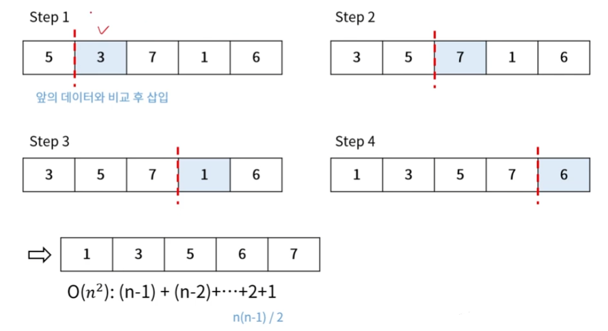

### 학습목표
- 알고리즘 개념에 대한 이해와 좋은 알고리즘을 구현하겠다는 의지

# 알고리즘 (Algorithm)

- 알고리즘 이란? 
    : 어떤 문제를 해결을 위한 절차나 방법

- 알고리즘의 조건 
    : 입력/출력/명확성/유한성/효율성

- 좋은 알고리즘
    : 정확성/사간복잡도/공간복잡도

## 1.정렬
- 특정 값을 기준으로 데이터를 순서대로 배치하는 방법
- 구현 난이도는 쉽지만, 속도는 느린 알고리즘
    : 버블/삽입/선택 정렬 

- 구현 난이도는 조금 어렵지만, 속도는 빠른 알고리즘
    : 합병/힙/퀵/트리 정렬

- 하이브리드 정렬 
    : 팀/블록 병합/인트로 정렬

- 기타 정렬 알고리즘
    : 기수/카운팅/셸/보고 정렬


### 1-1. 버블 정렬 (Bubble Sort)
- 인접한 데이터를 비교하며 자리 바꾸는 방식
- 알고리즘 복잡도: O(n^2)  


#### 버블 정렬 과정


#### 버블 정렬 구현
- 의사 코드 (Pseudocode) : 알고리즘 flow 파악 용 (실제 돌아가는 코드 X)
```
bubbleSort(arr[]) {
    arr[SIZE] :
    for i = to SIZE - 1 {
       for j = 0 to SIZE - i {
           if (arr[j] > arr[j + 1])
               swap(arr[j], arr[j+1])
        }   
    }
}
```


### 1-2. 삽입 정렬 (Insertion Sort)
- 앞의 데이터를 정렬 해가면서 삽입 위치를 찾아 정렬하는 방식
- 알고리즘 복잡도 : O(n^2)

#### 삽입 정렬 과정


#### 삽입 정렬 구현
- 의사 코드 (Pseudocode)
```
bubbleSort(arr[]) {
    arr[SIZE] :
    for i = 1 to SIZE{
       for j = i to 0 (j--) {
           if (arr[j] < arr[j - 1] )
               swap(arr[j], arr[j - 1])
        }   
    }
}
```

### 1-3. 선택 정렬 (Selection Sort)
- 최소 또는 최대 값을 찾아서 가장 앞 또는 뒤부터 정렬하는 방식
- 알고리즘 복잡도 : O(n^2)

#### 선택 정렬 과정


#### 선택 정렬 구현
- 의사 코드 (Pseudocode)
```
bubbleSort(arr[]) {
    arr[SIZE] :
    for i = i to SIZE - 1 {
       for j = i + 1 to 0 SIZE {
           if (arr[j] < arr[min] )
               min = j;
        }   
        swap(arr[i], arr[min])
    }
}
```

---

### 1-4. 합병 정렬 (Merge Sort)
- 배열을 계속 분할해서 길이가 1이 되도록 만들고, 인접한 부분끼리 정렬하면서 합병하는 방식
- 알고리즘 복잡도: O(nlogn)  <= O(n^2) 보단 빠른 속도를 가지고있다.

#### 합병 정렬 과정


### 1-5. 힙 정렬 (Heap Sort)
- 힙 자료구조 형태의 정렬 방식
- 기존 배열을 최대 힙으로 구조 변경 후 정렬 진행
- 알고리즘 복잡도: O(nlogn)

> [추가 자료](https://yozm.wishket.com/magazine/detail/2312/)  
> * 개념  
>  : Heap은 정렬, 우선순위, 큐, 스케줄링과 같은 다양한 알고리즘에서 활용되는 자료구조
> 1) 정의   
> 힙은 **완전 이진 트리 (Complete Binary Tree)**의 일종으로, 부모 노드와 자식 노드 간에 특정한 조건을 만족하는 자료구조를 말한다.
> 여기서 완전 이진 트리란 부모 노드 밑에 자식 노드가 최대 2개까지 있을 수 있고, 마지막 레벨을 제외한 모든 레벨에 노드가 완전히 채우져 있는 트리 구조를 말함.


### 1-6. 퀵 정렬 (Quick Sort)
- 임의의 기준 값을 정하고 그 값을 기준으로 좌우로 분할하며 정렬하는 방식
- 알고리즘 복잡도: O(n^2) <- 기준 값이 최소값 또는 최대값으로 지정되는 경우

#### 합병 정렬 과정


### 1-7. 트리 정렬 (Tree Sort)
- 이진 탐색 트리(BST)를 만들어 정렬하는 방식
- 알고리즘 복잡도: O(nlogn)

이진 탐색트리는 언제한거지??? -> 노드에서 구현함

---
### 1-8. 기수 정렬 (Radix Sort)
- 낮은 자리 수부터 정렬하는 방식
- 각 원소 간의 비교 연산을 하지 않아 빠른 대신, 기수 테이블을 위한 메모리 필요  
- 알고리즘 복잡도: O(dn) -> d는 최대 자릿수
    - [1,2,3,4,5] : 최대 자릿수:1, 배열의 크기:5 => 알고리즘 복잡도 = o(5)
    - [1000000,2000000,3000000,4000000,5000000] : 최대 자릿수:7, 배열의 크기:5 => 알고리즘 복잡도 = o(7*5)
                                                : 최대 자릿수가 배열의 크기보다 크면 worst case라고 볼 수 있다.

#### 합병 정렬 과정
1 의 자릿수를 기준으로 정렬하고 Deque를 시킴

10 의 자릿수를 기준으로 정렬하고 Deque를 시킴


### 1-9 계수 정렬 (Counting Sort)
- 숫자 끼리 비교하지 않고 카운트를 세서 정렬하는 방식
- 카운팅을 위한 메모리 필요
- 알고리즘 복잡도 : O(n + k) -> k는 정렬 대상 데이터 중 최대 값
 
#### 계수 정렬 과정
[10,32,10,27,32,17,99,56] 배열안에서 최댓값을 가진 원소(99)를 기준으로 카운팅 테이블을 생성한다.
  

### 셸 정렬 (Shell Sort)
- 삽입 정렬의 약점 보완한 정렬 방식
- 삽입 정렬의 약점
    - 오름차순 정렬 기준, 내림차순으로 구성된 데이터에 대해서는 앞의 데이터와 하나씩 비교하며 모두 교환 필요
- 이전의 모든 데이터와 비교하지 않고 일정 간격을 두어 비교
- 알고리즘 복잡도: O(n^2)
  - 간격 설정에 따라 Worst case는 삽입 정렬과 동일
  - 일반적인 산포 데이터 기준으로 삽입 정렬에 비해 빠르다.
  
#### 셸 정렬 과정
요소들간의 간격 설정은 `배열 길이 / 2` 로 설정한다.
현재 예시는 모두 내림차순으로 정렬되어 있기 때문에 Worst Case이다.

- 초기 간격 gap = 8 / 2

- gap = gap / 2 = 4 / 2


## 정렬 알고리즘 복잡도 Summary
- Ω : 베스트 케이스 
- θ : 평균 케이스
- Ο : 워스트 케이스

  - 보조 메모리
    - 정렬을 할 때 원래 데이터가 들어있던 배열 외의 추가로 필요한지에 대한 데이터 
    - 1 -> swap 할 때 임시변수 하나 사용하는 것, 제자리 정렬이 가능한 것 (inplace정렬)
    - 만약 컨스턴스 메모리 외의 추가 메모리를 사용하지 말라고한다면 보조메모리의 값이 1이 아닌것은 피해서 사용해야 한다.


